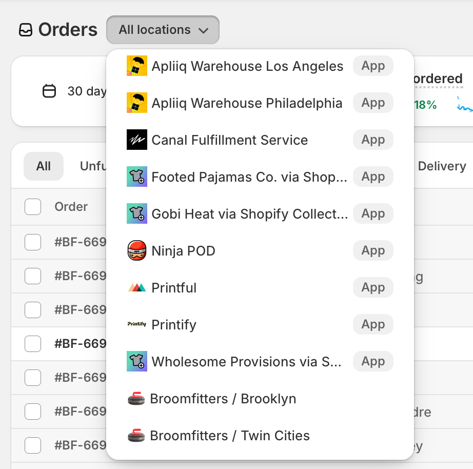
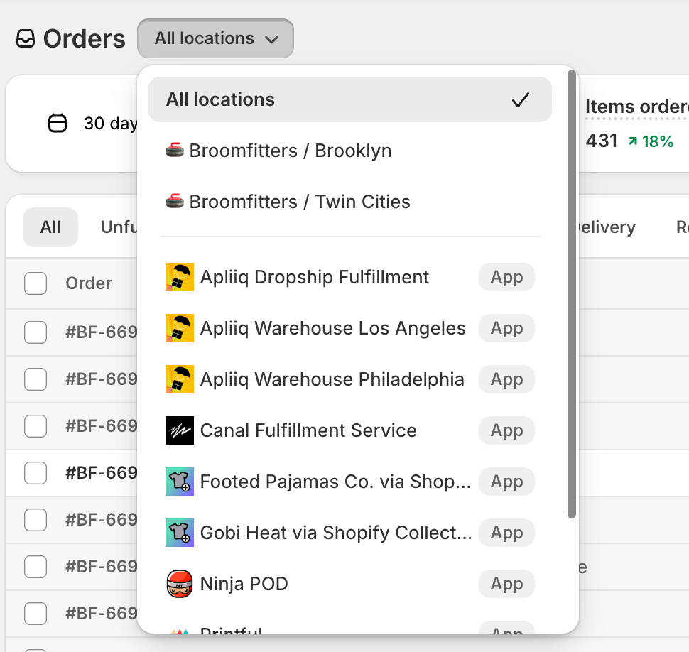

# Shopify Location Dropdown Orderer

A Chrome extension that automatically reorders the location dropdown in Shopify admin to show your actual store locations before app-based fulfillment locations.

## Problem

By default, Shopify mixes all locations together without separating physical stores from app-based fulfillment locations. App locations (like Printful, Printify, Apliiq, etc.) often appear scattered throughout or before your actual store locations. This makes it inconvenient to quickly find and select your physical stores.

## Solution

This extension automatically reorders the location dropdown to display:
1. "All locations" (always first)
2. Your actual store locations (e.g., "Broomfitters / Brooklyn", "Broomfitters / Twin Cities")
3. Visual divider
4. App-based fulfillment locations (sorted last)

**Works for any Shopify store!** The extension automatically detects app locations by identifying Shopify's "App" badge - no configuration needed.

## Before & After

<table>
<tr>
<th>Before</th>
<th>After</th>
</tr>
<tr>
<td>

App locations appear before your actual stores, making it harder to find your physical locations.
</td>
<td>

Your store locations appear first, followed by a clean divider, then app locations - much easier to navigate!
</td>
</tr>
</table>

## Installation

### Load the Extension in Chrome

1. Open Chrome and navigate to `chrome://extensions/`
2. Enable "Developer mode" (toggle in the top-right corner)
3. Click "Load unpacked"
4. Select the folder containing this extension
5. The extension should now appear in your extensions list

### Verify It Works

1. Navigate to your Shopify admin panel (e.g., `https://admin.shopify.com/store/your-store/orders`)
2. Click on any location dropdown (e.g., in the Orders page)
3. The dropdown will automatically reorder to show your store locations first!

### Optional: Generate Custom Icons

Icons are optional but recommended for a better visual experience.

1. Open `generate-icons.html` in your web browser
2. Click the "Generate Icons" button
3. Right-click each canvas image and save as:
   - `icon16.png`
   - `icon48.png`
   - `icon128.png`
4. Save all three PNG files in the extension folder
5. Reload the extension in `chrome://extensions/` to see the icons

## How It Works

The extension uses a MutationObserver to detect when the Shopify location dropdown appears in the DOM. When detected, it:

1. Identifies which locations are apps by detecting Shopify's `<s-internal-badge>App</s-internal-badge>` element
2. Separates actual store locations (no badge) from app locations (with badge)
3. Reorders the list to prioritize store locations
4. Inserts a divider between store and app locations
5. Maintains the "All locations" option at the top

The extension works on any Shopify store because it detects Shopify's standard UI components, not specific location names.

## Files

- `manifest.json` - Extension configuration
- `content.js` - Main script that reorders the dropdown
- `generate-icons.html` - Tool to generate extension icons
- `icon.svg` - SVG source for the extension icon
- `README.md` - This file

## Browser Compatibility

- Chrome (Manifest V3)
- Edge (Chromium-based)
- Other Chromium-based browsers

## Privacy

This extension runs entirely locally in your browser and:
- Does not collect any data
- Does not make any network requests
- Only modifies the visual order of elements in the Shopify admin interface

## Development

To modify the extension:

1. Edit `content.js` to change the reordering logic
2. Update `manifest.json` if you need to change permissions or URLs
3. Go to `chrome://extensions/` and click the refresh icon on the extension card to reload your changes

## Troubleshooting

**The dropdown is not reordering:**
- Verify the extension is enabled in `chrome://extensions/`
- Confirm you're on a Shopify admin page (should include `admin.shopify.com` in the URL)
- Open the browser console (F12) and look for messages starting with "Shopify Location Dropdown Orderer"

**The extension icon is not showing:**
- Generate the icon PNG files using `generate-icons.html` (see Optional: Generate Custom Icons above)
- Click the refresh icon on the extension card in `chrome://extensions/`

## License

MIT License - Feel free to modify and distribute as needed.

## Contributing

Found a bug or have a suggestion? Feel free to open an issue or submit a pull request!
